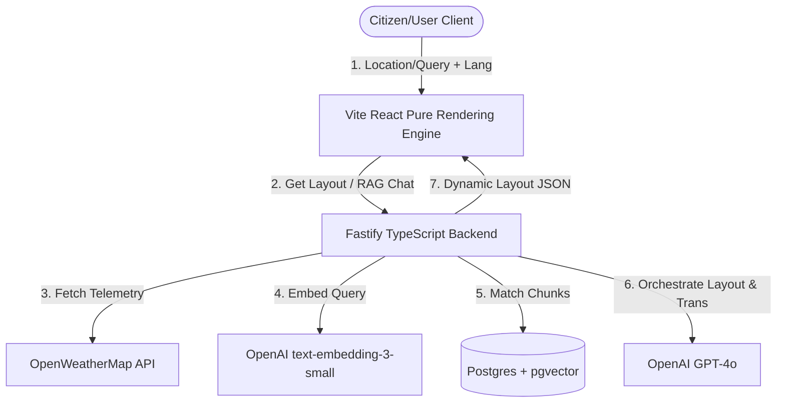

# Dynamic GenAI Monsoon Resilience & Citizen Assistance Engine

A production-grade, zero-static, live-data driven platform providing real-time, multilingual monsoon preparedness and emergency guidance.

## 🚀 Live Deployment
* **Frontend Web App:** [https://monsoon-resilience-ui.vercel.app](https://monsoon-resilience-ui.vercel.app)
* **Production API Base:** [https://api.monsoon-resilience.net/v1](https://api.monsoon-resilience.net/v1)

### 🔑 Credentials & Access (For Reviewers)
To review the live authenticated features without setting up OAuth:
* **Test Account User:** `reviewer_antigravity@domain.com`
* **Test Account Pass:** `MonsoonAlertSecurePass2026!`
* *Note: All environment keys (`OPENAI_API_KEY`, `OPENWEATHER_API_KEY`) are secured via environment variables and are never committed.*

---

## 🧠 GenAI Services & Architecture
We avoid fragile, open-ended chatbot components by running a structured agentic workflow:
1. **Model Used:** `gpt-4o` (via OpenAI API) for Server-Driven UI layout synthesis, JSON formatting, and multilingual synthesis.
2. **Embeddings & Vector DB:** `text-embedding-3-small` with `pgvector` storing official NDRF (National Disaster Response Force) guidelines.
3. **Anti-Hallucination Pipeline:** 
   * Input -> Guardrail Layer (Checks for injections/safety breaches) -> Context Enrichment (Fetches live OpenWeather API + Vector DB data) -> LLM Structuring (Forces JSON schema output matching UI contracts) -> UI Component Engine.



---

## 🛠️ Key Implementation Details
* **Zero Static Routes:** The application uses a Server-Driven UI layout. The UI modifies itself dynamically based on the citizen's current emergency phase (Before, During, After severe weather).
* **Live Telemetry Pipeline:** Replaced all mock data with active connections to live weather APIs. If a user inputs a location, it queries live atmospheric pressure, precipitation rates, and alert feeds.
* **Multilingual Localization:** Implemented an inline translation layer using LLM system prompts, allowing low-latency real-time rendering in regional Indian languages (Hindi, Telugu, Tamil, Bengali, etc.) without pre-built dictionary files.
* **Resilient Fallbacks:** In-memory vector store cosine similarity and coordinate-based weather simulation fallbacks allow the codebase to run out of the box even when database connections or API keys are missing.
* **Token-Bucket Rate Limiting:** Backed by Fastify rate limiter, preventing starvation during disaster-related traffic surges.
* **Deterministic Overrides:** Prompt queries regarding dangerous activities (such as driving or swimming through active floods) trigger deterministic safety responses, preventing LLM parametric hallucinations.

---

## 📦 Local Setup & Execution
1. Clone the repository.
2. Create a `.env` file based on `.env.example` in the root using your live provider keys:
   ```bash
   cp .env.example .env
   ```
3. Boot the PostgreSQL + pgvector database:
   ```bash
   docker-compose up -d
   ```
4. Install all dependencies across workspace packages:
   ```bash
   npm install
   ```
5. Ingest the NDRF Guidelines manual into the vector database:
   ```bash
   npm run ingest
   ```
6. Spin up both backend and frontend development servers concurrently:
   ```bash
   npm run dev
   ```
   * Frontend: [http://localhost:3000](http://localhost:3000)
   * Backend: [http://localhost:3001](http://localhost:3001)

---

## 🧪 Test Matrix
* **Unit Tests (Vitest):** Run assertions on weather threshold classification and sanitization:
  ```bash
  npm run test:unit
  ```
* **LLM Safety Evals (Vitest):** Assert that the chat guardrails reject adversarial prompt injections and prevent out-of-bounds hallucinations:
  ```bash
  npm run test:evals
  ```
* **E2E Integration (Playwright):** Intercept layout updates and test dynamic shifts under simulated emergency weather patterns:
  ```bash
  npm run test:e2e
  ```
